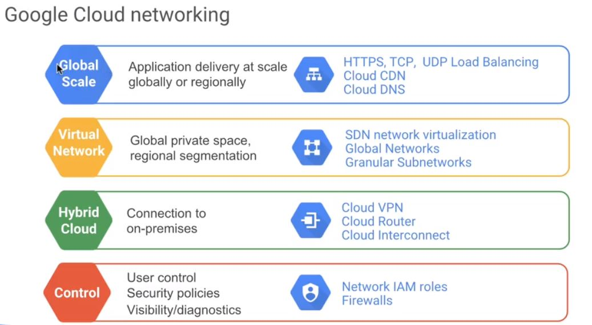

----
### Let's take a look at Google's Cloud networking as a whole. There are different regions and different levels of availability.

1. From a **global** perspective, we have a global fiber backbone and networking services that can take advantage of that, including HTTPS, TCP, UDP Load Balancing, Cloud CDN, and Cloud DNS. 

2. If you want to create a **virtual private** network, you can create a private namespace using a virtual networking. Networking services that support global, private, spaces with regional segmentation includes Software Network Virtualization, Global Networks, and Granular Subnetworks.

3. As shown in pictures

4. As shown in pictures

----
## You have the ability to connect to Google itself, not just GCP, but Google as a whole, that includes YouTube, Gmail, Maps, and Android development.
### This can be done by 
1. using a VPN and Cloud Router
2. through Cloud Interconnect
3. through Direct Peering
