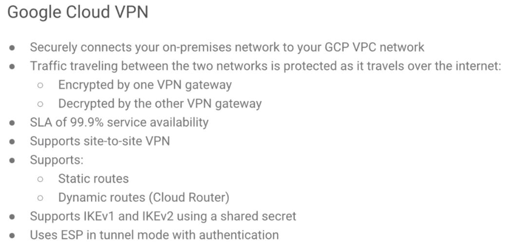
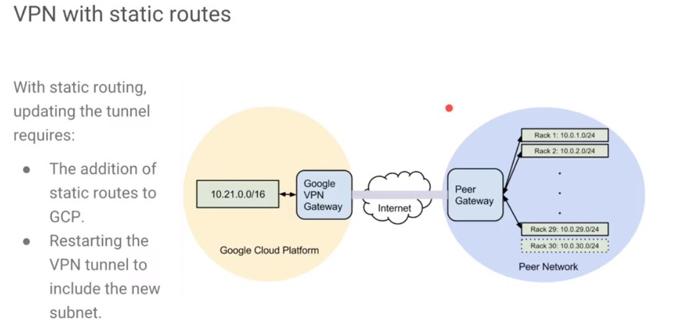

----
# Google Cloud VPN
1.  Google Cloud VPN securely connects your on-premises network to your GCP VPC network through an IPsec VPN connection. 
2. Traffic travelling between the two networks is encrypted by one VPN gateway and then decrypted by the other VPN gateway. 
 - This protects your data as it travels over the Internet.
3. VPN devices in Google Cloud are software devices. There is no actual VPN on the other side. We do all we can to ensure compatibility between the on-premise hardware version with specific versions of IKE which can also be run over Cloud Interconnect.

----

This diagram shows the example topology using a **VPN tunnel** to connect a **Google Cloud network** and **29 subnets**, one per rack, in the on-premises network. Here, we are adding the **30th subnet**.