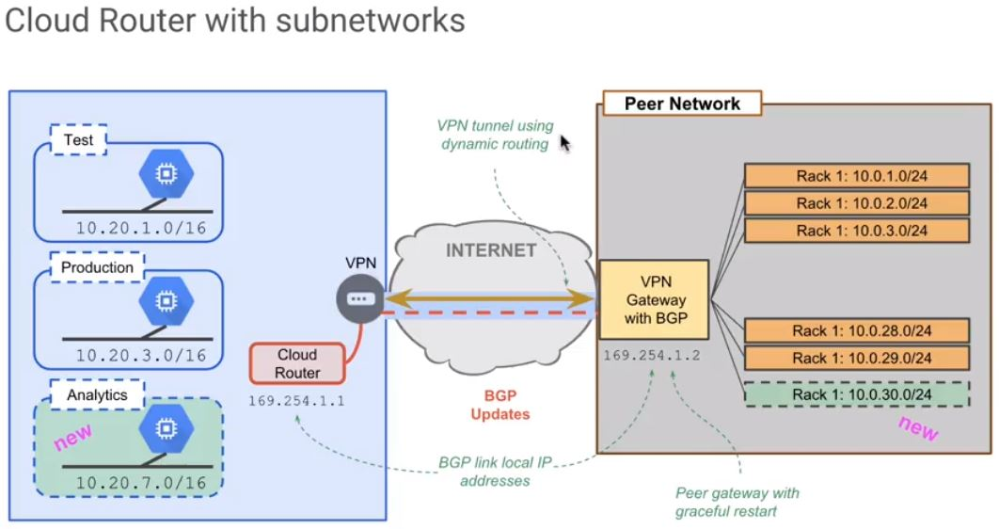

# Cloud Router
* is basically a router that runs in the cloud.
* Provides BGP routing
 - Dynamically discovers and advertise new route changes, that might be in your network. 
  - If you're peering with Google and you have a number of internal routes, and you want us to know about new routes that might become available, especially if you're peering with us in multiple locations, you can utilize Cloud Router for that purpose.
* Supports graceful restart
* Supports ECMP
* Primary/Backup tunnels for failover
 - MED
 - AS Path length
 - AS Prepend

----

Let's just say we've spun up a new environment in the cloud called analytics. We have a new subnet range, right here, that we need to make available and make known to an on-premise peering network. Utilizing cloud router, it would announce that the new sub-net is now available. Then the existing BGP router on premise, will be able to update its routing tables, and know how to get to this new allocated subnetwork for the analytics process, and vice versa. If you add a new subnet range, a new physical rack goes online with a different set of subnets, that can be identified and can tell the cloud router on the cloud side, that a new network exists. Now these applications, test and prod, perhaps they're funneling data back to the on-premise network. We'll now have a method to get those routes back as well.
