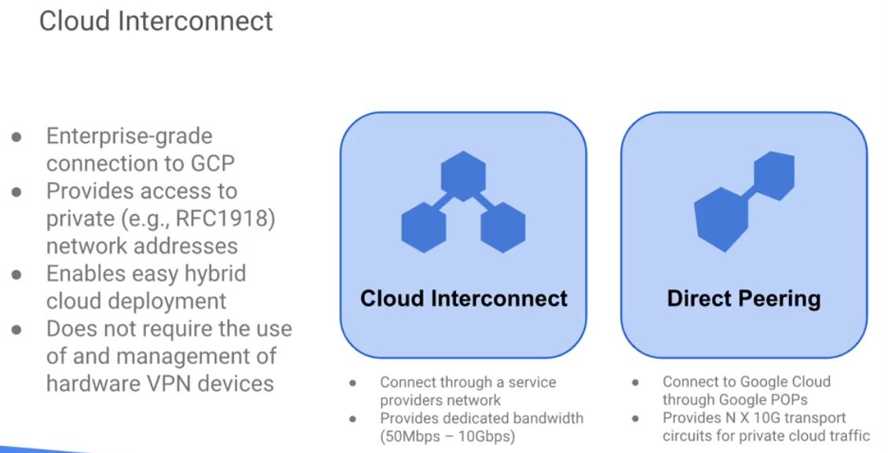
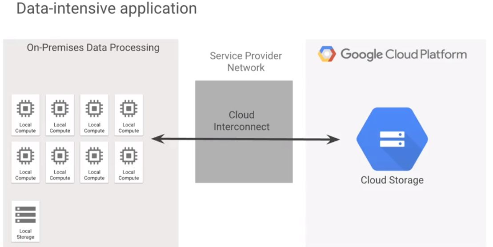
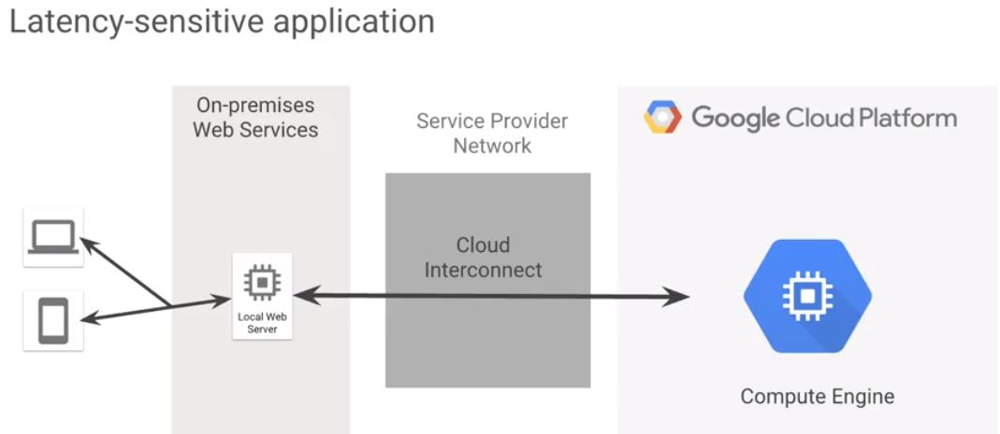
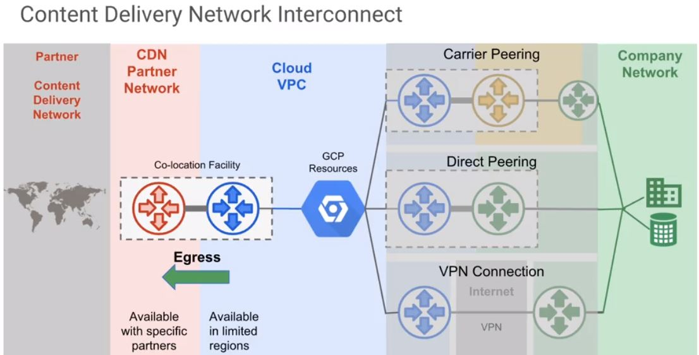

# Cloud Interconnect

* ~ provides direct physical connections and RFC1918 communication between your on-premises network and Google's network.
* ~ enables you to transfer large amounts of data between networks, which can be more cost-effective than purchasing additional bandwidth over the public internet.

----
* Traffic between your on-premises network and your VPC network does not traverse the public internet.
* Traffic traverses a dedicated connection with fewer hops, meaning there are less points of failure where network traffic might get dropped or disrupted.
* Your VPC network's **internal IP addresses** are directly accessible from your on-premises network. You don't need to use a net device or VPN tunnel to reach internal IP addresses.
 - Currently, you can only reach internal IP addresses over a **dedicated** connection.
* To reach Google **external IP addresses**, you must use a **separate** connection.
 - You can scale your connection to Google based on your needs.
 - Connection capacity is delivered over one or more 10 Gigabits per second Ethernet connections with a **maximum** of eight connections. That's **80 Gigabits per second total per interconnect**. 
 - The **cost** of egress traffic from your VPC network to your on-premises network is reduced. A dedicated connection is generally the least expensive method if you have a high volume of traffic to and from Google's network.
 - The **minimum deployment per location is 10 Gigabits per second**. If your traffic doesn't require that level of capacity, consider **Cloud VPN**.

----
## Data Security
The circuit between your network and Google's network is not encrypted.    
If you require additional data security, use application level encryption or your own VPN.
Currently, you can't use Google Cloud VPN in combination with a dedicated connection, but you can use your own VPN solution. 

----
### Before you use dedicated interconnect, consider the following:
1. You must be familiar with basic network interconnections. You'll be ordering and configuring circuits. 
2. Your network must physically meet Google's network in a colocation facility. In the colocation facility, you're on-premises network devices must support the following technical requirements:
 - 
3. You must provide your own routing equipment.

----
## in the practical application of a **data-intensice application**
### Why using Cloud Interconnect?
1. to simply save on bandwidth connection cost
2. because you want to ensure that you can take advantage of **on-site backup**
 - If you want to backup huge amounts of data to Google Cloud Storage, you would invest the time to setup a pairing arrangement to do so.

----
## in the practical application of a **latency-sensitive application**
* ~, you might have local web servers, but they may be pulling data from on-premise database servers because the data might be restricted and not allowed to be in the cloud for whatever **security policy reasons** 
### Why Peering with Google?
* ~ will ensure that you have the lowest latency possible between the two locations.

----

* Cloud Interconnect allows you to take advantage of your **Content Delivery Network, CDN**, or your CDN partner network. 
* While Google does offer its own CDN, it's still rather restrictive in its capabilities, and leveraging our CDN partners will provide you access to a lot more features. 
* It's best to research which one may be most applicable to you. You may benefit by lower rates or lower latency to the CDN partners services. More information can be found in the CDN Interconnect Documentation.