----
## Direct peering
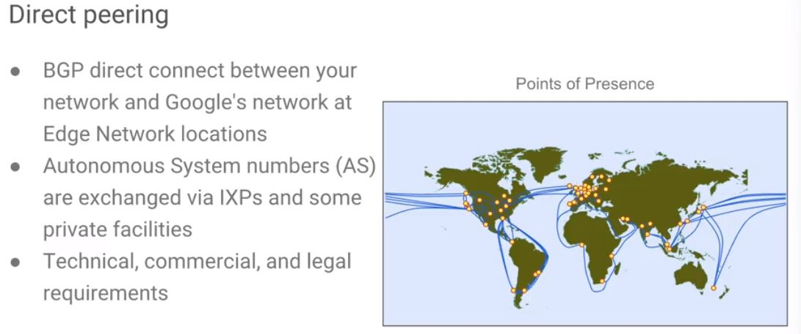
* ~ is that private connection between you and Google, or your company and Google, where we exchange **autonomous system numbers**.

### autonomous system numbers (AS)
* ~ is your identity on the internet that represents your block of IP addresses.
* It's much like a domain name that reflects your company's name, which translates toa single IP.
* An autonomous system number represents your block of owned IP addresses on the internet.
* If you were to announce your autonomous system number, you could describe it as the route in order to get to me as a company.
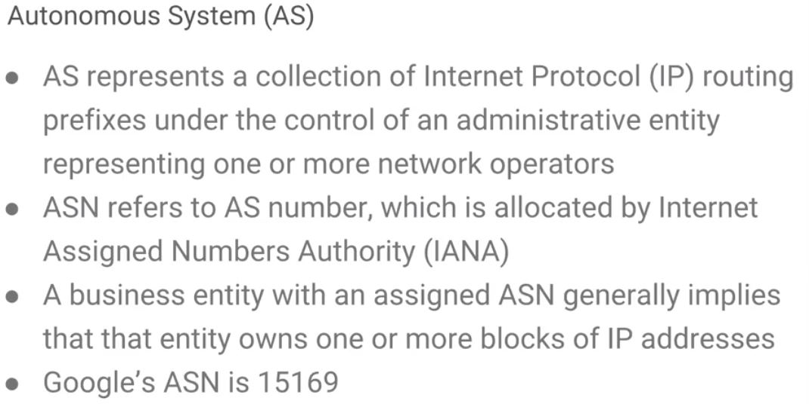
* If you do want to peer with Google, you want to look up our ASN number, which is **15169**
----
## Visual for direct peering
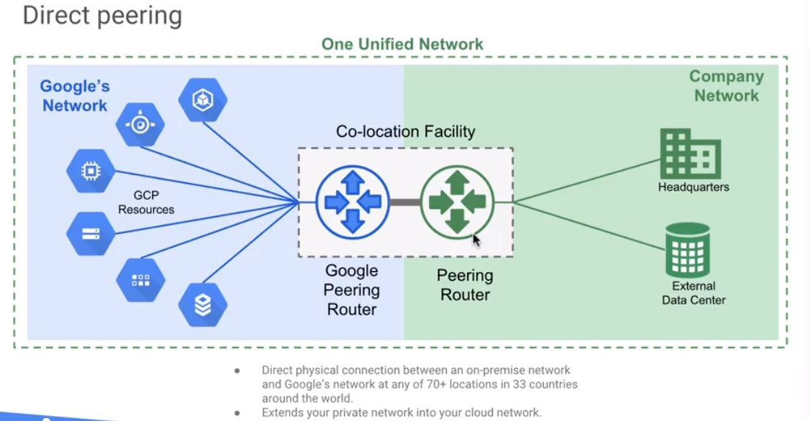

* Google allows you to establish a direct peering connection between your business network and Google's.
* With this connection, you can exchange internet traffic between your network and Google's at one of their broad reaching edge network locations. 
* Direct peering with Google is done by **exchanging BGP routes between Google and the peering entity**.
* After a direct peering connection is in place, you can use it to reach all of Google's services including the full suite of Google Cloud platform products.

----
## Visual for carrier peering
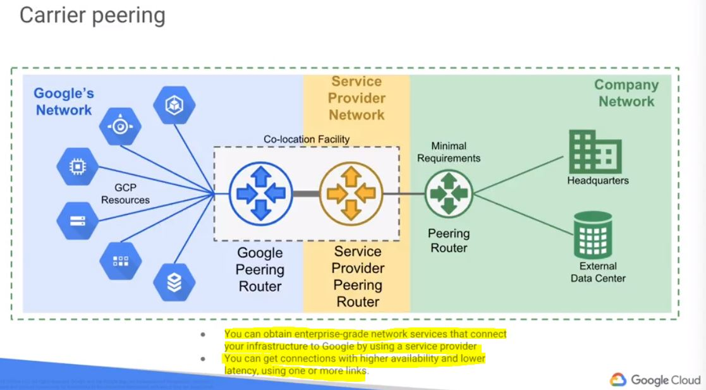

* As you can see, it's a similar setup, but you have a **service provider**, so-called a **middle-man**. 

----
## Key concepts of peering
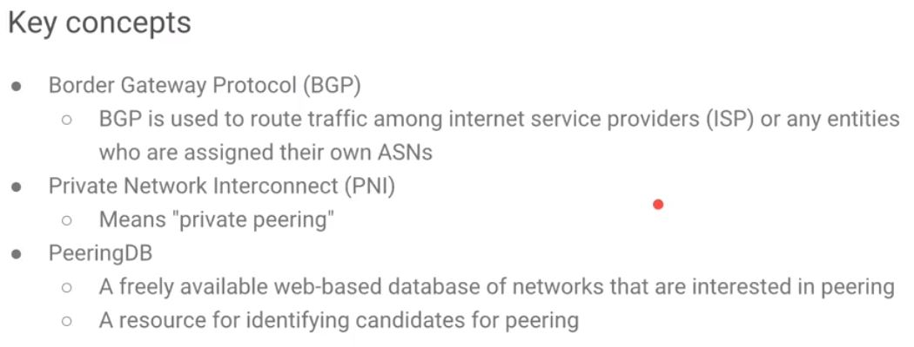

----
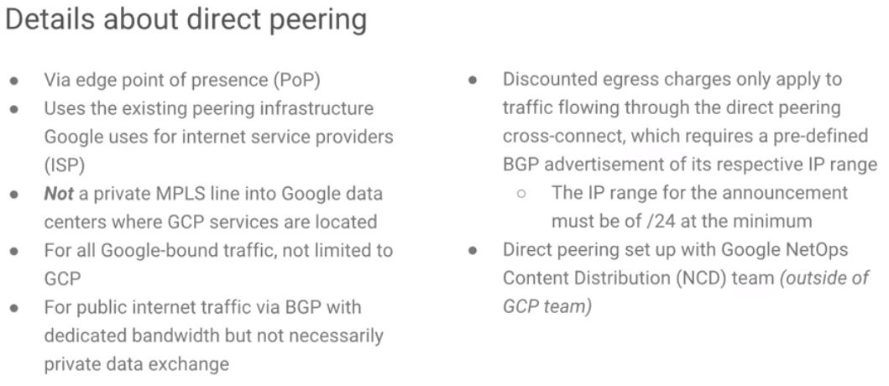

----
## You can share GCP VPC networks across projects in your cloud organization using shared VPC
* In large organizations, you may need to put different departments or different applications into different projects for purposes of separating budgeting, access control, et cetera. 
* With shared VPC, cloud organization administrators can give multiple projects permission to use a single shared VPC network and corresponding networking resources

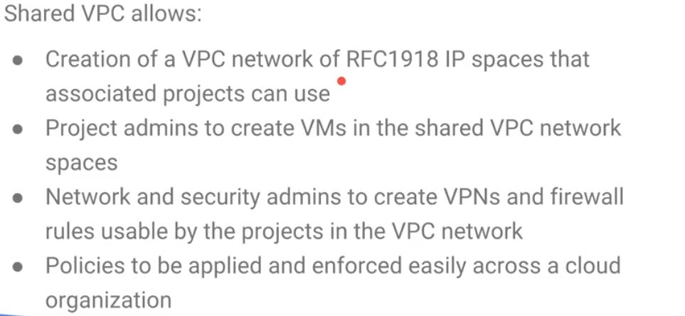

----
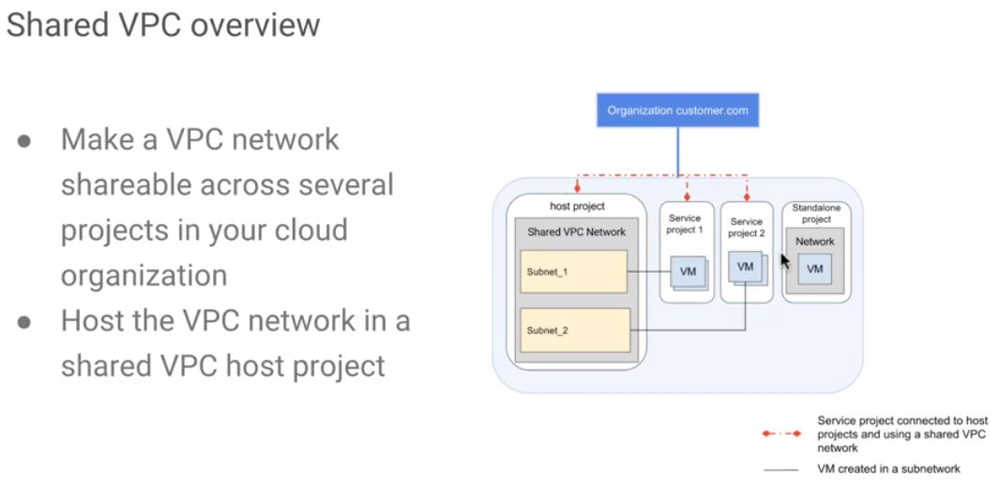

> The diagram shows a host project sharing its VPC network with two service projects. 

> It is sharing Subnet_1 with one project and Subnet_2 with another project. 

> The standalone project has not been designated a service project, so it can't share resources with the host project. 

----
### You can connect two VPC networks regardless of shared projects/organizations using VPC network peering.

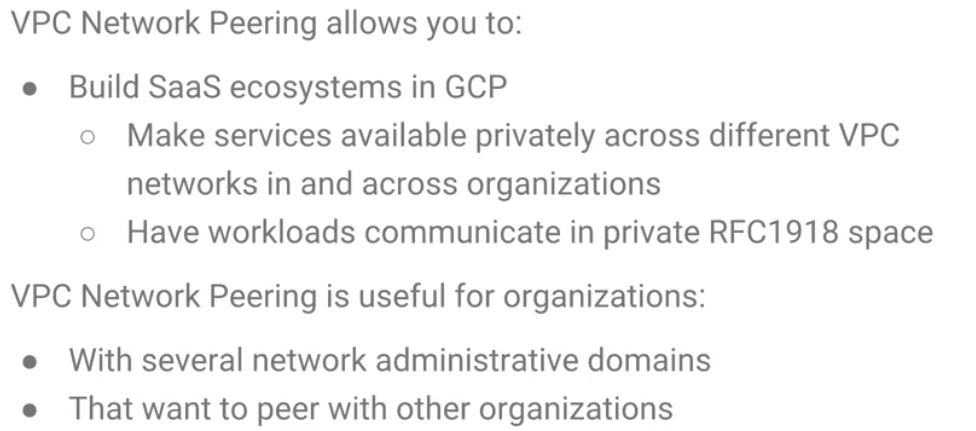

----
## VPC Network Peering advantages

VPC Network Peering provides the following advantages over using external IP addresses or VPNs to connect networks
* Network latency
 - Public IP networking suffers higher latency than private networking
* Network security
 - Service owners do not need to have their services exposed to the public internet and deal with tis associated risks
* Network cost
 - GCP charges egress bandwidth pricing for networks that use external IPs to communicate even if the traffic is within the same zone
 - However, if the networks are peered, they can use internal IPs to communicate and save on those egress costs.
 - Regular network pricing still applies to all traffic.

----
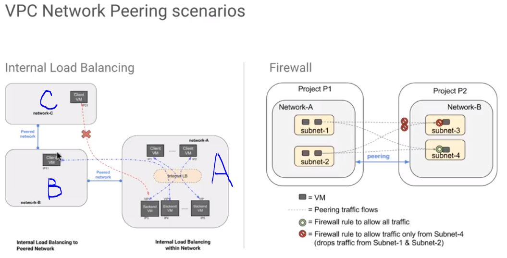

* The Internal Load Balancing diagram shows how VM isntances in network B access the load balance backends in network A.
* The internal load balancing configuration from network A is automatically applied to network B in this case.
* Internal balancing services are available to clients and directly peered networks only.
* In the case that network B peers with network C, the internal load balance backends in network A will not be reachable from clients in network C.
* If you have peering between your VPC network and another VPC network, you want to block traffic to a given set of VM instances or internal load balancing endpoints.

* You must use **firewall** rules to do this because there is no way to exclude certain VM instances or internal load balancers from the peering.
* If you want to disallow communication with certain VM instances or internal load balancers, you can install ingress firewall rules on the network you want to block the communication to.

* The diagram shows you how you could create a firewall rule to allow all traffic from Subnets 1 and 2 in network A to Subnet 4 in network B and deny traffic from Subnets 1 and 2 in network A to Subnet 3 in network B. 

----
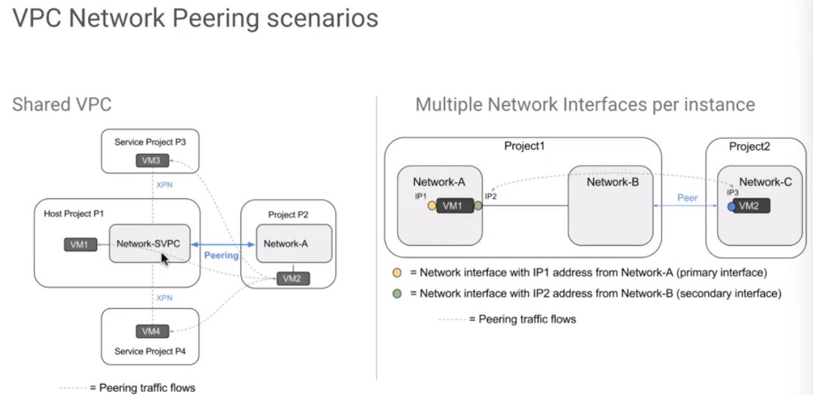
* VPC network peering allows peering with a shared VPC.
* In the shared VPC diagram right here, network-SVPC, is in a shared VPC network and host project P1. Service projects P3 and P4 are able to attach VM instances to network SVPC peers with network A.

### Results
* VM instances in shared VPC service projects that are using the network **SVPC** have private internal IP connectivity with any endpoints associated to network A. 
* VM instances associated to network A will have private internal IP connectivity with any endpoints associated to network SVPC regardless of whether they live in the host project or a service project.

----
You can set up VPC network peering between two shared VPC networks. An instance can have multiple network interfaces, one each in different VPC networks, which is shown here on the diagram on the right.

* In the diagram, VM1 has a network interface in both network A and network B.
* Network B is peered with another network C.
* IP3 can send traffic to IP2 because IP2 is in network B, and network B routes are automatically propagated to network C when the two networks are peered.
* For IP2, right here, to send traffic to IP3, you'd have to configure policy routing for the IP2 interface. 
* Flows for IP1 are not installed in network C, so network C cannot access IP1.

----
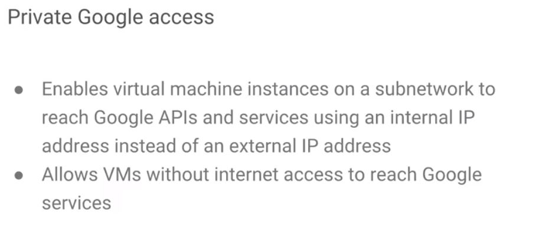

* External IP addresses are routable and reachable over the internet. 
* Internal or private IP addresses are internal to Google Cloud platform and are not routable or reachable over the internet.

* The services that can be reachable include but are not limited to the following: Cloud Spanner, Google Cloud Big Query, Google Cloud Bigtable, Google Cloud Dataproc, Google Cloud Datastore, Google Cloud Pub/Sub and Google Cloud Storage. 
* Private Google access does **not** apply to Google Cloud SQL. You do not get private connectivity to Cloud SQL when you use private Google Access.