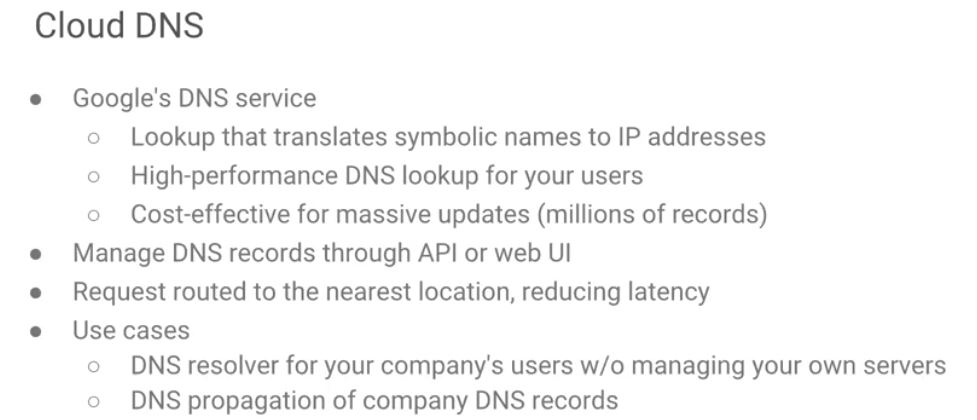

# Cloud DNS
* ~ is the only service inside of Google that offers a 100% SLA. That is a 100% uptime guarantee.

> In fact, because nothing runs unless your DNS can resolve you to an IP address, there may be small application issues, small availability issues, but if you can't look up a domain name, the internet might as well be down. So, that's why you have never gone into google.com and says sorry I can't find this IP address.

* You can actually host all of your authoritative DNS records directly through Cloud DNS.
 - You can call those through an API or through the Web Console.

----
# Cloud DNS managed zones
* ~ are an abstraction that manages all DNS records for a single domain name.
* One project may have multiple managed-zones.
* You must enable the Cloud DNS API in the GCP Console first by running **gcloud dns managed-zones**.
* Managed-zones 
 - provide permission controls at project level
 - allow you to monitor propagation of changes to DNS name servers.